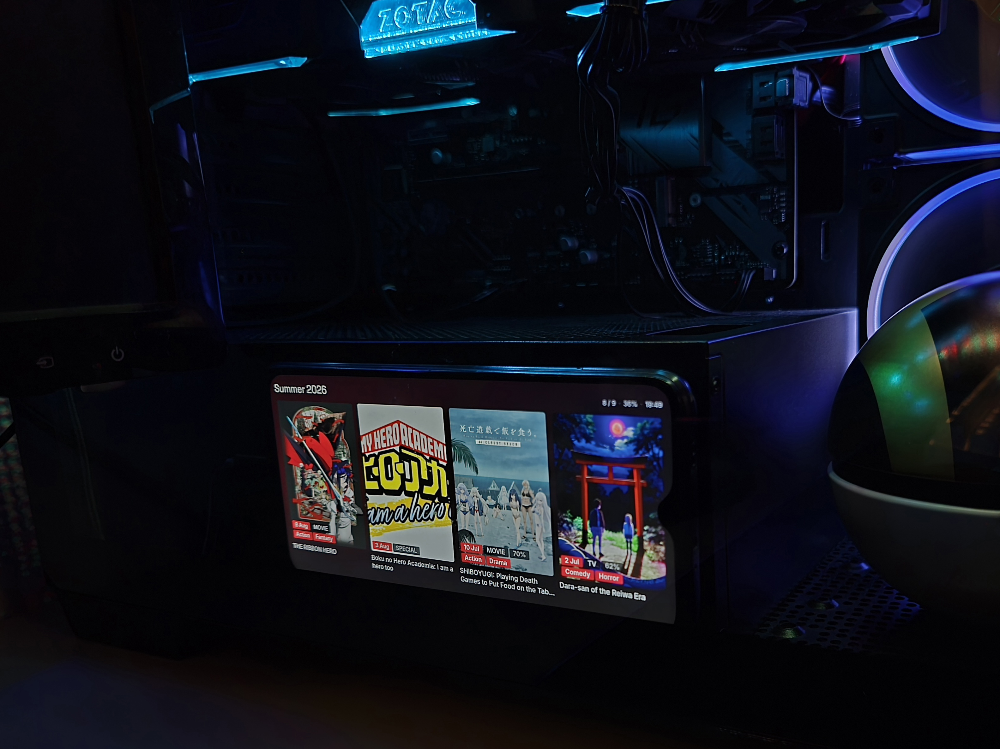
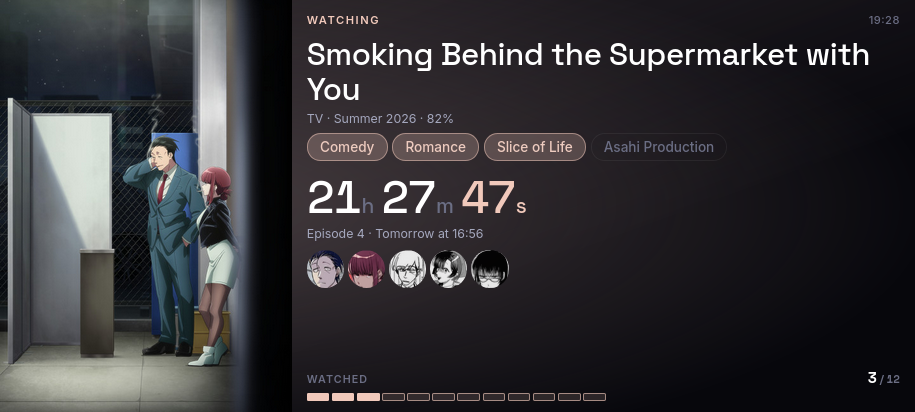
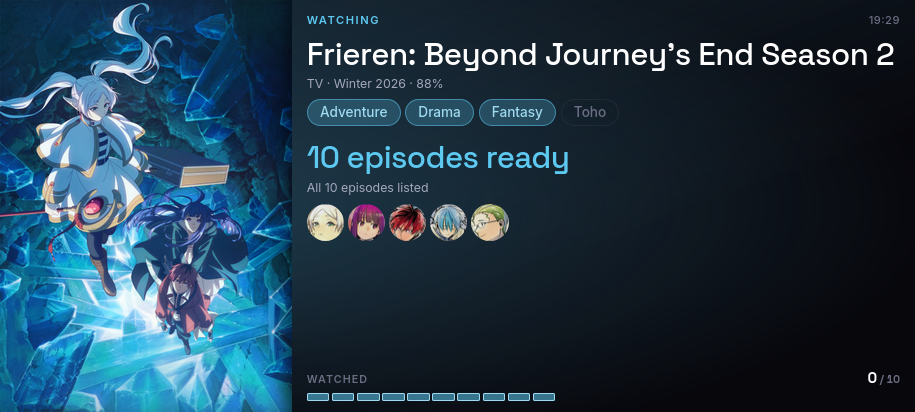
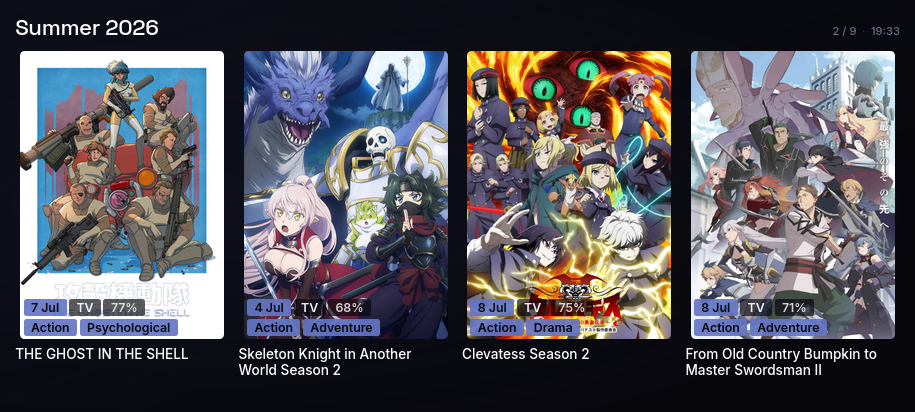
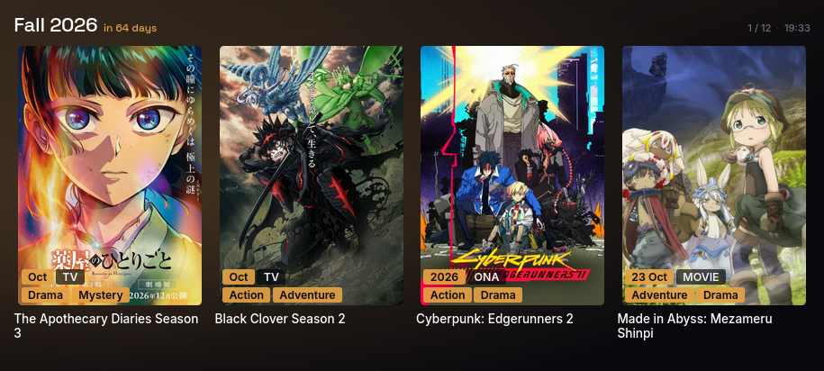
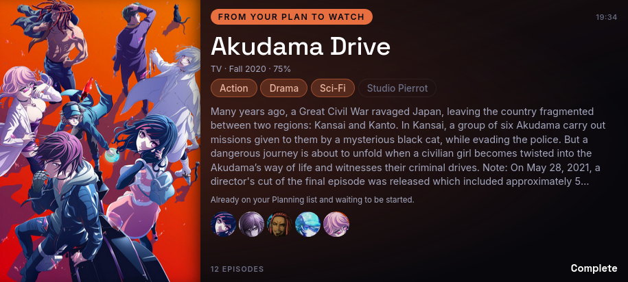
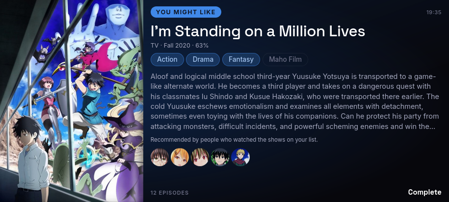
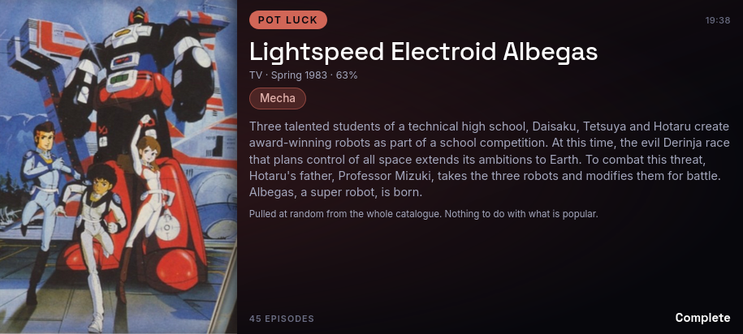
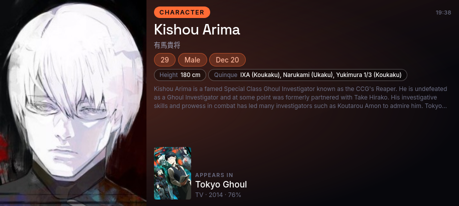

# AniList Dashboard

A fullscreen AniList dashboard designed for repurposing an old Android phone or tablet as a dedicated anime display.

<p align="center">
  
</p>

The dashboard reads public AniList data, rotates through several views, caches the latest successful response, and adapts its accent colour to the current title. It is a single static `index.html` file and does not require an API key, build step, backend, or database.

## Features

- Current watch list with episode countdowns and progress
- Aired-but-unwatched episode highlighting
- Current-season and next-season discovery pages
- Planning-list picks, AniList recommendations, and random catalogue picks
- Anime statistics and recent activity
- Character spotlight screens
- Dynamic accent colours based on AniList cover artwork
- Touch zones and animated transitions
- Local cache for quick startup and temporary offline resilience
- Optional Jikan character portraits
- Battery readout where the browser or kiosk app exposes it

## Tested device

The current layout was designed and tested on a **Xiaomi Redmi 9T in landscape orientation**.

It should also work on many Android phones and tablets, but some device-specific configuration may be required. Depending on the manufacturer, Android version, browser, display aspect ratio, and system skin, you may need to adjust:

- Landscape orientation lock
- Fullscreen or kiosk mode
- Keep-screen-awake behaviour
- Launch on boot or application autostart
- Battery-optimisation exclusions
- Local-file access permissions
- Browser permissions for Wake Lock or battery information
- Display size, font scaling, notch, and cutout handling

The interface uses viewport-relative sizing, so it adapts to different screens. Very short, very wide, or tablet-sized displays may still need small CSS adjustments.

## Running the dashboard

The dashboard can be opened directly as a local `index.html` file or hosted on any static web server, including GitHub Pages.

## Fully Kiosk Browser

This project was tested using **[Fully Kiosk Browser](https://www.fully-kiosk.com/en/#download-box)**.

Fully Kiosk Browser is recommended for turning an Android phone or tablet into a permanent fullscreen display because it can keep the screen awake, lock the orientation, hide browser controls, and launch automatically after reboot.

Recommended settings:

- Start URL: local `index.html` file or the hosted dashboard URL
- Screen orientation: landscape
- Fullscreen mode: enabled
- Keep screen on: enabled
- Launch on boot: enabled where available
- Battery optimisation: disabled for Fully Kiosk Browser

On Xiaomi and MIUI devices, also check application autostart and background battery restrictions. Menu names and available options may differ on Samsung, Realme, Motorola, Pixel, and other Android devices.

## Configuration

Open `index.html` and find the `CONFIG` object near the beginning of the JavaScript section.

```javascript
const CONFIG = {
  // Your AniList username.
  username: "Your_Username",
  dataUrl: "auto",
  screenSeconds: 20,
  seasonPerPage: 4,
  refreshMinutes: 30,
  queueSize: 5,
  extraPortraits: true,
  portraitSeconds: 4.5,
  debug: true,
  airingOnly: false,
};
```

| Setting | Purpose |
|---|---|
| `username` | Public AniList username whose list and statistics are displayed |
| `dataUrl` | `"auto"` checks for `/data.json` first and otherwise queries AniList directly; use `null` to always query AniList directly |
| `screenSeconds` | Time each screen stays visible |
| `seasonPerPage` | Number of seasonal titles shown per page |
| `refreshMinutes` | How often fresh data is requested |
| `queueSize` | Number of queued cover thumbnails |
| `extraPortraits` | Enables additional character portrait lookups through Jikan |
| `portraitSeconds` | Time between optional portrait changes |
| `debug` | Enables additional console logging |
| `airingOnly` | Limits the watch-list rotation to titles with future episodes |

Only public AniList data is used. No AniList password or API key should be placed in the file.

## Controls

| Input | Action |
|---|---|
| Tap the left half | Switch to the next dashboard view |
| Tap the right half | Advance within the current view |
| `Arrow Left` | Switch to the next dashboard view |
| `Arrow Right` | Advance within the current view |

The screen briefly glows at the touched edge to confirm the input.

## Adjusting the layout for another phone

The most useful CSS values are near the top of `index.html`:

| CSS area | What it changes |
|---|---|
| `--pad` | Global spacing around text and panels |
| `.poster` | Main cover width and aspect ratio |
| `.title`, `.title.long`, `.title.longer` | Anime-title sizing |
| `.countdown` | Countdown size |
| `.grid` | Number of seasonal columns |
| `.tile .art` | Seasonal cover height |
| `.person .portrait` | Character portrait width |

For a narrower phone, reduce the largest text sizes or the poster width. For a tablet, consider increasing the grid column count and spacing.

## Screenshots

<table>
  <tr>
    <td align="center" width="50%">
      
      <br>
      <sub><b>Watching view</b> — Shows the current anime, episode progress, genres, studio, and countdown to the next episode.</sub>
    </td>
    <td align="center" width="50%">
      
      <br>
      <sub><b>Watching view</b> — Highlights episodes that have already aired and are ready to watch.</sub>
    </td>
  </tr>

  <tr>
    <td align="center" width="50%">
      
      <br>
      <sub><b>Current season</b> — Displays popular anime from the current season with release dates, formats, genres, and scores.</sub>
    </td>
    <td align="center" width="50%">
      
      <br>
      <sub><b>Next season</b> — Provides a preview of upcoming anime and their expected release dates.</sub>
    </td>
  </tr>

  <tr>
    <td align="center" width="50%">
      
      <br>
      <sub><b>Planning pick</b> — Surfaces an anime from the user's AniList Planning list.</sub>
    </td>
    <td align="center" width="50%">
      
      <br>
      <sub><b>Recommendation</b> — Suggests an anime based on titles already present in the user's AniList library.</sub>
    </td>
  </tr>

  <tr>
    <td align="center" width="50%">
      
      <br>
      <sub><b>Random pick</b> — Selects an unexpected title from the wider anime catalogue for discovery.</sub>
    </td>
    <td align="center" width="50%">
      
      <br>
      <sub><b>Character spotlight</b> — Shows a featured character, profile details, and the anime they are associated with.</sub>
    </td>
  </tr>
</table>

## Data sources

- [AniList GraphQL API](https://docs.anilist.co/)
- [Jikan API](https://docs.api.jikan.moe/) for optional additional character artwork
- Google Fonts: Space Grotesk and Inter

Anime titles, metadata, character information, and artwork belong to their respective owners and are loaded from third-party services at runtime. Screenshots in this repository are included only to demonstrate the interface.

## Privacy and security

- The dashboard reads public data only.
- It does not modify the AniList account.
- It does not request or store a password.
- Browser cache and settings remain on the device.
- Do not add private tokens, passwords, or API keys before publishing the repository.

## License

The project code is available under the [MIT License](LICENSE).

This project is not affiliated with or endorsed by AniList, MyAnimeList, Jikan, Xiaomi, Fully Kiosk Browser, or any anime publisher.
